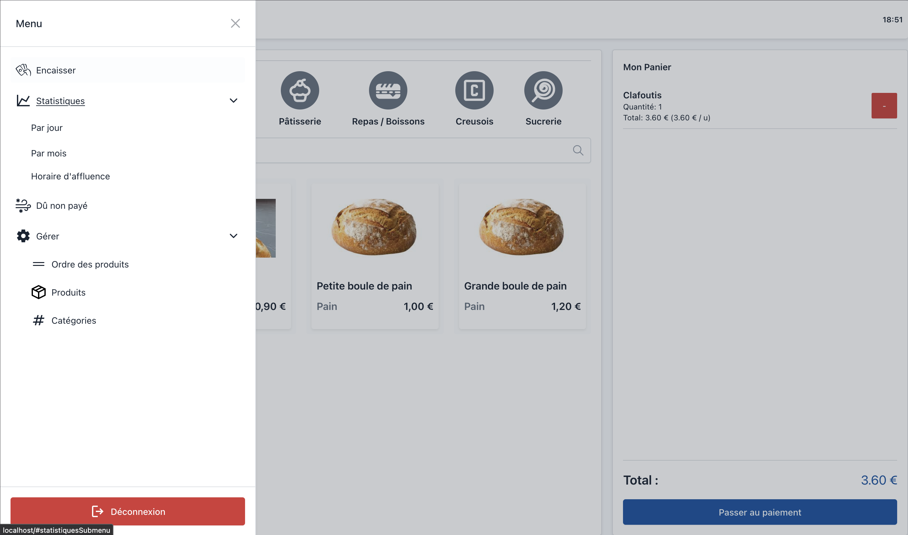
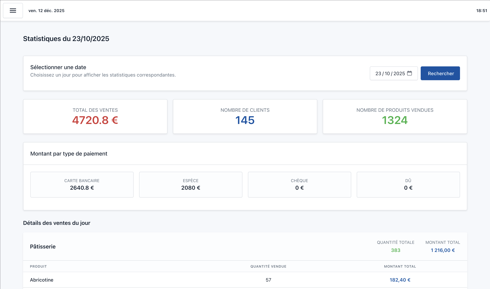

<a id="readme-top"></a>

<div align="center">

<h1 align="center">Terminaly</h1>

<div>
  
  
</div>

<p align="center">
  A French-based Symfony-powered kiosk application designed for fast-food vendors, combining intuitive ordering, role-based management, and advanced sales analytics.
  <br />
  <a href="#"><strong>Explore the docs »</strong></a>
  <br />
</p>
</div>

<!-- ABOUT THE PROJECT -->

## About The Project

Terminaly is a modern ordering system built with Symfony 7.3, designed for fast-food environments where speed, clarity, and efficient workflow matter.

The application provides a clean and intuitive interface where vendors can:
- Browse categories and see related products instantly
- Add items to a real-time cart overview
- Process payments via cash, check, card, or mark an order as unpaid due
- Enter cash received and display remaining change automatically

On the administration side, the platform includes:
- A full role-based administration system (admins, vendors, etc.)
- Product and category management with drag-and-drop sorting powered by SortableJS
- Weekly affluence tracking based on order timestamps
- Detailed statistics per day and month (payment types, revenue, quantities sold, graphs, and more)
- Excel export for monthly statistics (using PhpSpreadsheet)
- A debt management interface to validate unpaid orders
- Authentication with email-based password reset (in progress)

The goal is to provide a complete, reliable, and efficient kiosk system for fast-food restaurants.

## Built With
- Symfony 7.3
- Twig
- Doctrine ORM
- SortableJS
- Chart.js
- PhpSpreadsheet
- Bootstrap / SCSS

<!-- GETTING STARTED -->

## Getting Started

Follow these steps to run Terminaly locally:

### Prerequisites
- PHP ≥ 8.2
- Composer
- Symfony CLI (recommended)
- MySQL or MariaDB

symfony check:requirements

### Installation

1. Clone the repository:
git clone https://github.com/github_username/terminaly.git

2. Install dependencies:
composer install

3. Configure your .env database URL.

4. Run migrations:
php bin/console doctrine:migrations:migrate

5. Start the Symfony server:
symfony serve

<!-- USAGE -->

## Usage

### Vendor Interface

The kiosk interface allows staff to:
- Select categories and instantly view related products
- Add items to the cart
- View the full cart overview
- Process payments:
  - Cash (with input for received amount and automatic remaining change)
  - Card
  - Check
  - Unpaid due (with customer name input)
- Print or validate the order

### Admin Interface

Admins have access to:
- Product and category management
- Drag-and-drop product ordering
- Sales statistics by day and month
- Weekly affluence tracking
- Excel export for monthly reports
- Due payments validation
- User and role management
- Authentication settings

<!-- ROADMAP -->

## Roadmap

- [x] Category and product browsing  
- [x] Real-time cart system  
- [x] Payments: cash, check, card  
- [x] Unpaid due management  
- [x] Role-based admin dashboard  
- [x] Product sorting with SortableJS  
- [x] Daily statistics  
- [x] Monthly statistics  
- [x] Excel export for monthly stats  
- [x] Weekly affluence tracking  
- [x] Basic authentication system  
- [ ] Password reset by email  
- [ ] Invoice sender  
- [ ] Export graphs as downloadable images  
- [ ] English support  
- [ ] Additional analytics features  
- [ ] UI and UX improvements  

More improvements can be tracked in the issue section.


<!-- CONTRIBUTING -->
## Contributing

1. Fork the project  
2. Create a feature branch:  

```sh
git checkout -b feature/AmazingFeature
```

3. Commit your work:  

```sh
git commit -m "Add some AmazingFeature"
```

4. Push your branch:  

```sh
git push origin feature/AmazingFeature
```

5. Open a pull request  

### Top Contributors

<a href="https://github.com/thibaultfradet/launchy/graphs/contributors">
  
</a>
